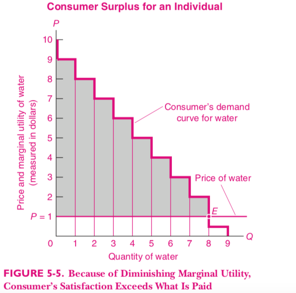
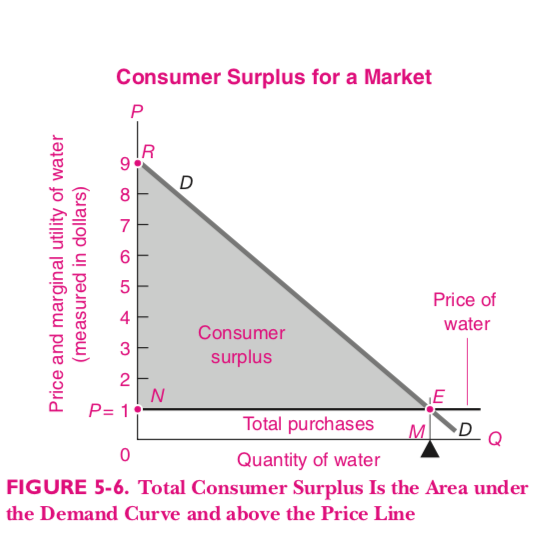

```{r setup, include=FALSE}
options(htmltools.dir.version = FALSE)
knitr::opts_chunk$set(
  fig.width=6, fig.height=3.5, fig.retina=3,
  out.width = "100%",
  cache = FALSE,
  echo = FALSE,
  message = FALSE, 
  warning = FALSE,
  hiline = TRUE,
  dev = "png", 
  dev.args = list(type = "cairo-png")
)

library(tibble)
library(ggplot2)
library(showtext)
library(purrr)
library(kableExtra)
library(tibble)
library(emo)
library(dplyr)
library(ggplot2)

font_add_google("Lato", "Lato")
font_add_google("Merriweather", "Merriweather")
theme_set(theme_minimal(base_family = 'Lato', base_size=16))

```

```{r xaringan-themer, include=FALSE, warning=FALSE}
library(xaringanthemer)


colores <- c(celeste="#5e82ae", 
             color3="#89a2c3",
             color1="#698BB4",
             color2="#5D81AD",
             verde="#4E7B7B")

# ,,5D81AD,,000000
style_mono_accent(
  base_color = "#5e82ae",
  #secondary_color = "",
  header_font_google = google_font("Lato"),
  text_font_google   = google_font("Merriweather"),
)

source('./excedente_control_precios.R')
source('./excedente_impuestos.R')
```


# La teoría del consumidor

- Es la base conceptual de la curva de demanda que analizamos en la unidad anterior.
- Permite analizar como un consumidor toma decisiones económicas.


---
# La utilidad
- Es un concepto fundamental para analizar las decisiones del consumidor.
- El consumidor toma decisiones económicas para obtener la máxima utilidad, o satisfacción derivada de los bienes que consume.

---
# Utilidad total
- El consumidor elige entre combinaciones de bienes:
  - 1 kilo de papas y 0.5 de zanahorias.
  - 2 kilos de cebollas y 0.5 kilos de papas.
  
- Elige la combinación (o canasta) que le reporta mayor utilidad total.

---
# Utilidad marginal

- Es la utilidad extra que le reporta al consumidor agregar una unidad de un bien a la canasta.
- Es una función de la cantidad consumida del bien.
- Si 1 helado me da 10 unidades de utilidad y dos helados me dan 18, la segunda unidad me agregó 8 unidades de utilidad.

---
# Ejemplo

| Cantidad  | Utilidad Total  | Utilidad Marginal   |
|-----------|-----------------|---------------------|
|     0     |   0             | -                    |
|     1     |   4             |   4                   |
|     2     |   7             |   3                  |
|     3     |   9             |   2                  |
|     4     |   10            |   1                  |
|     5     |   10            |   0                  |


La utilidad total es la suma de las utilidades marginales de las unidades consumidas.

---
# Utilidad marginal decreciente

- Si bien la utilidad total aumenta a medida que consumimos mayores cantidades de un bien, la utilidad marginal decrece.

- Si no tomamos Coca Cola, el primer vaso nos da mucha satisfacción. Si nos ofrecen otro vaso, probablemente prefiramos dos vasos a uno solo, pero el segundo vaso aumenta menos mi utilidad que el primero.
---

# El principio de equimarginalidad

- Este principio implica que la utilidad marginal del dinero gastado en todos los bienes que compramos debe ser igual.

- Qué es $\frac{UM_{alfajores}}{P_{alfajores}}$?

Es la utilidad que me da gastar un peso extra en alfajores. Si un alfajor vale $50 y me da 100 unidades de utilidad, un peso extra gastado en alfajores me da 2 unidades de utilidad.
---

# El principio de equimarginalidad (2)

- En equilibrio debe cumplirse que 
$$ \frac{MU_1}{P_1} = \frac{MU_2}{P_2} = ... = \frac{MU_n}{P_n}$$

---
# La pendiente de la curva de demanda

- Esta ecuación me permite derivar la pendiente negativa de la curva de demanda.
- Recordamos que $MU$ es una función de la cantidad consumida $(Q)$.
- Si sube $P_1$, para mantener la igualdad, $MU_{1}$ tiene que subir. La forma de hacer que $MU_{1}$ suba es consumir menos del bien 1.

---
# El excedente del consumidor

- La curva de demanda representa la disponiblidad a pagar por cierta cantidad demandada.
- El precio de equilibrio se determina en el cruce con la curva de oferta.
- Para las primeras unidades compradas la disponiblidad a pagar es más alta que para las últimas.
- Pero todas las unidades se venden al mismo precio.

---

# Consumidor individual



---

# Consumidor individual (2)

- Las unidades anteriores generan mayor satisfacción que el precio que paga el consumidor.

---

# El mercado




---

# Usos

- Se calcula como el área entre el precio y la curva de demanda.
- Si la curva de demanda es lineal, es un triángulo.
- Sirve para calcular el bienestar que los consumidores obtienen por participar en un mercado.
- Sirve para cuantificar los efectos de políticas económicas (impuestos, etc.) o distintos regímenes de competencia.

---
# Aplicación a controles de precios

El gobierno impone un precio mínimo de $4
```{r}
antes
```

---
# Antes del control


|       Concepto              | Valor           |
|-----------------------------|-----------------|
| Excedente del Productor     |   90000         |
| Excedente del Consumidor    |   90000         |
| Recaudación                 |   0             | 
| Total                       |    180000       | 


---
# Controles de precios
```{r}
despues

```


---
# Análisis del bienestar

|            Concepto         | Valor             |
|-----------------------------|-------------------|
| Excedente del Productor     |     40000         |
| Excedente del Consumidor    | 800 + 400 = 120000|
| Total                       |     160000        |


- Pérdida del  bienestar: 20000

---
# Aplicación a impuestos

El gobierno impone un impuesto de $3.
```{r}
impuesto_consumidores
```

---
# Impuestos
```{r}
impuesto_productores
```


---
# Bienestar antes del impuesto

|       Concepto              |  Valor          |
|-----------------------------|-----------------|
| Excedente del Productor     |         8       |
| Excedente del Consumidor    |         4       |
| Recaudación                 |         0       | 
| Total                       |         12      |

---
# Bienestar
```{r}
bienestar_con_impuesto
```

---
# Cálculo

|    Concepto               |  Valor        |
|---------------------------|---------------|
| Excedente del Productor   |     2         |
| Excedente del Consumidor  |     1         |
| Recaudación               |     6         | 
| Total                     |     9         |

Pérdida: 4
